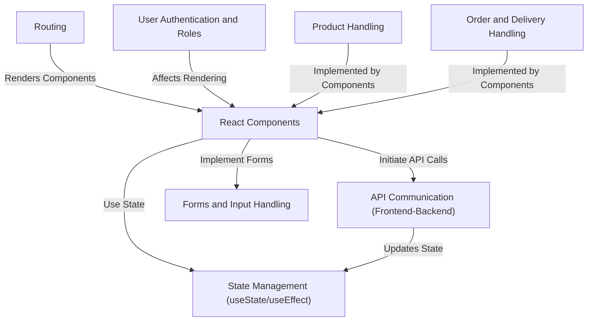
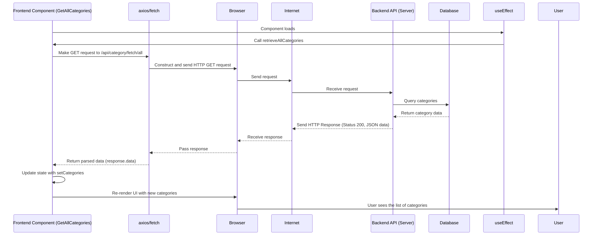
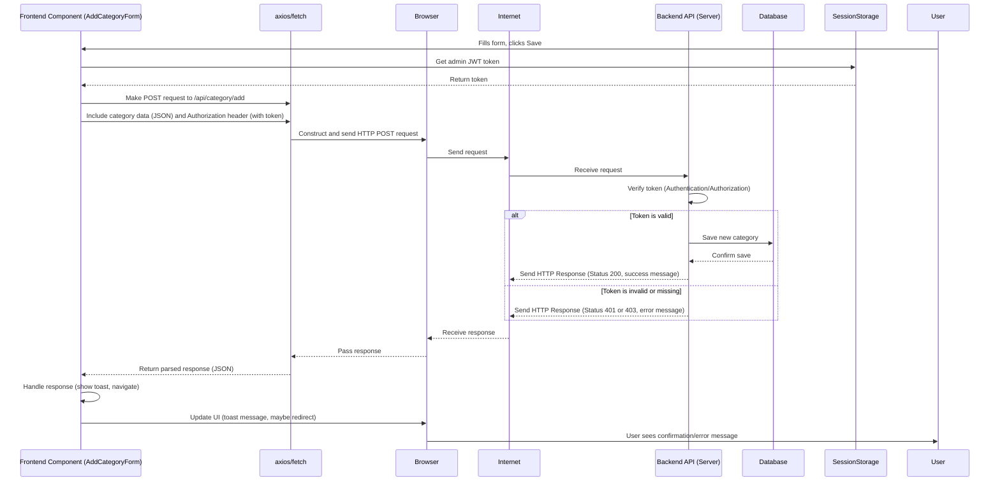
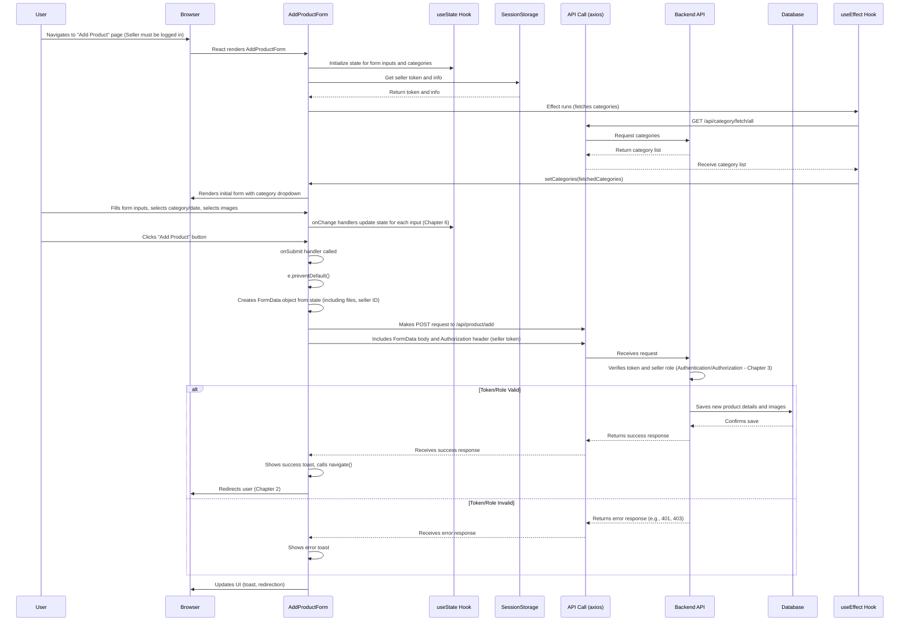
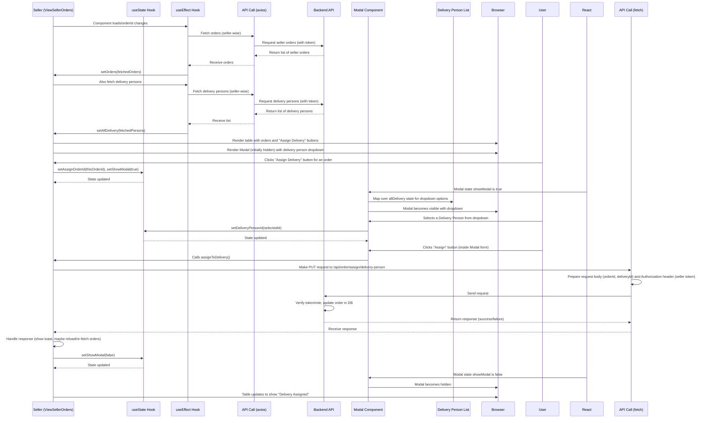
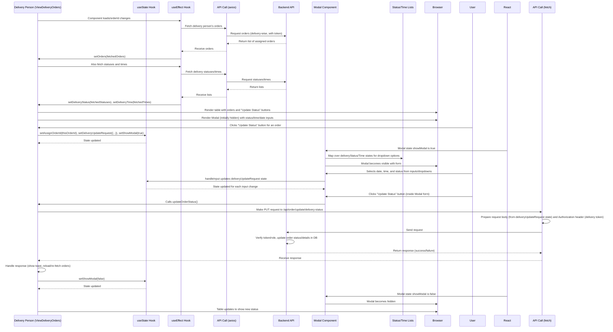

# Online Auction System 
## Frontend

This project is a frontend application for an **online auction system**. It allows users to **browse and bid** on products listed by sellers, handles **user registration and login** based on different roles (Admin, Customer, Seller, Delivery Person), manages **product listings** and categories, and facilitates the **ordering and delivery** process after an auction concludes. It provides distinct interfaces and functionalities based on the logged-in user's role.

## Visual Overview

## How It Works Under the Hood (Simplified)

Let's visualize the process of fetching categories:

For a POST request like adding a category by an Admin, the flow is similar but includes sending data and the authentication token:

## `fetch` vs. `axios`

While both achieve the same goal, `axios` is often preferred for several reasons, many of which are demonstrated in the project's code:

| Feature             | `fetch` (Built-in)                      | `axios` (Library)                            |
| :------------------ | :-------------------------------------- | :------------------------------------------- |
| Installation        | None (built-in)                         | Requires `npm install axios`                 |
| Data in Response    | Requires extra step (`response.json()`) | Automatically in `response.data`             |
| Request Body (POST) | Requires `JSON.stringify()`             | Automatically stringifies JSON data          |
| Headers             | Set manually in `headers` object        | Set manually, potentially cleaner syntax     |
| Error Handling      | `.catch()` only for network errors. HTTP errors (like 404, 500) are *not* in `.catch()`. Need to check `response.ok` or `response.status` in `.then()`. | `.catch()` handles both network errors *and* HTTP errors (400s, 500s). Often simpler error flow. |
| Request Interception| Not natively supported                  | Supports intercepting requests/responses     |

Our project uses both, likely due to different developers or historical reasons. Understanding the basics of both is helpful, but `axios` is very common in React development.

### Adding a Product - Sequence Diagram

This diagram illustrates the complex flow involving form input handling, state updates, authentication checks, constructing a `FormData` request, and sending it to the backend API.

### Assigning Delivery - Sequence Diagram

### Updating Delivery Status - Sequence Diagram

